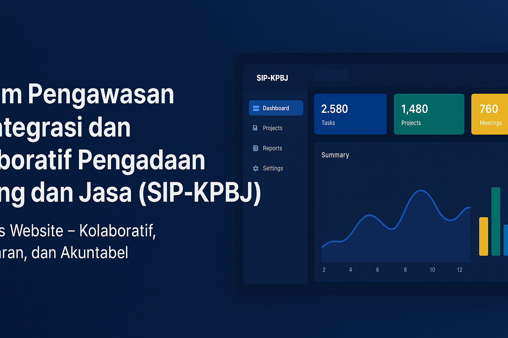

# SIP-KPBJ  
## Sistem Pengawasan Terintegrasi dan Kolaboratif Pengadaan Barang dan Jasa



**SIP-KPBJ** adalah aplikasi dashboard berbasis web yang dirancang untuk mendukung **pengawasan, monitoring, dan pengelolaan pengadaan barang dan jasa** secara terintegrasi, transparan, dan akuntabel.  
Aplikasi ini ditujukan untuk lingkungan **pemerintahan maupun organisasi** yang membutuhkan kontrol pengadaan berbasis data dan audit-ready.

**Tagline:**  
> Kolaboratif • Transparan • Akuntabel

---

## 🎯 Tujuan Sistem

SIP-KPBJ dikembangkan untuk membantu organisasi dalam:

- Meningkatkan transparansi proses pengadaan
- Mendukung pengawasan dan audit berbasis data
- Mengurangi kesalahan manual dalam pengelolaan dokumen dan paket
- Mempermudah monitoring kinerja dan kompetensi SDM pengadaan
- Menyediakan laporan analitis sebagai dasar pengambilan keputusan

---

## 🚀 Fitur Utama

- **Dashboard Utama**  
  Ringkasan data pengadaan, statistik, dan visualisasi real-time

- **Manajemen Paket Pengadaan**  
  Pengelolaan paket dari perencanaan hingga pelaporan

- **Dokumen & Arsip Digital**  
  Penyimpanan dan pencarian dokumen terpusat

- **Pengawasan & Audit**  
  Monitoring proses pengadaan untuk meningkatkan akuntabilitas

- **Manajemen Vendor**  
  Data penyedia barang dan jasa yang terlibat

- **Kompetensi PPK**  
  Monitoring dan evaluasi kompetensi Pejabat Pembuat Komitmen

- **Monitoring & Evaluasi**  
  Evaluasi berkala terhadap proses dan performa pengadaan

- **Laporan & Analisis**  
  Generate laporan berbasis data untuk kebutuhan evaluasi dan audit

- **Manajemen Akses Pengguna**  
  Role-based access control untuk keamanan sistem

- **Panduan & Bantuan**  
  Dokumentasi penggunaan dan troubleshooting

- **Profil Pengguna**  
  Pengaturan akun, preferensi, dan kalender pribadi

- **Autentikasi Aman**  
  Sistem login dan registrasi dengan kontrol keamanan

---

## 🛠️ Teknologi yang Digunakan

### Frontend
- React 18
- TypeScript
- Tailwind CSS
- React Router

### Library Pendukung
- ApexCharts & React ApexCharts
- FullCalendar
- React JVectorMap
- React DnD

### Tooling
- Vite
- ESLint
- GitHub Pages (`gh-pages`)

---

## 📦 Instalasi & Setup

### 1. Clone Repository
```bash
git clone https://github.com/mhmdfdln14/spkmb.git
cd spkmb
