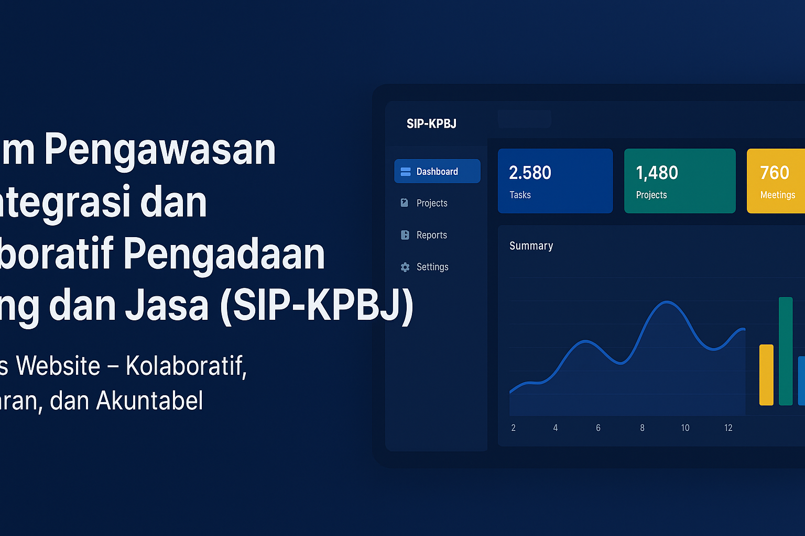

# SPKMB - Sistem Pengelolaan Kompetensi dan Monitoring Berkala



**SPKMB** adalah singkatan dari **Sistem Pengelolaan Kompetensi dan Monitoring Berkala**, sebuah aplikasi dashboard modern yang dirancang untuk mengelola proses pengadaan, kompetensi, monitoring, dan audit dalam lingkungan pemerintah atau organisasi. Dibangun dengan teknologi React dan Tailwind CSS, aplikasi ini menyediakan antarmuka yang intuitif dan responsif untuk memudahkan pengelolaan data terkait paket pengadaan, dokumen arsip, pengawasan audit, vendor penyedia, kompetensi PPK (Pejabat Pembuat Komitmen), monitoring evaluasi, laporan analisis, pengaturan akses, dan panduan bantuan.

## Fitur Utama

- **Dashboard Utama**: Ringkasan visual dari aktivitas sistem dengan grafik dan statistik real-time.
- **Manajemen Paket**: Kelola paket pengadaan dari awal hingga akhir proses.
- **Dokumen Arsip**: Simpan dan akses dokumen penting dengan mudah.
- **Pengawasan Audit**: Lakukan audit dan pengawasan terhadap proses pengadaan.
- **Vendor Penyedia**: Daftar dan kelola vendor yang terlibat dalam pengadaan.
- **Kompetensi PPK**: Pantau dan kelola kompetensi Pejabat Pembuat Komitmen.
- **Monitoring Evaluasi**: Evaluasi berkala terhadap performa sistem dan proses.
- **Laporan Analisis**: Generate laporan analisis untuk wawasan mendalam.
- **Pengaturan Akses**: Kontrol akses pengguna dengan sistem otorisasi yang ketat.
- **Bantuan Panduan**: Panduan lengkap untuk pengguna baru dan troubleshooting.
- **Profil Pengguna**: Edit profil, pengaturan akun, dan kalender pribadi.
- **Autentikasi Aman**: Sistem login dan signup dengan proteksi keamanan.

## Tujuan Aplikasi

SPKMB bertujuan untuk meningkatkan efisiensi dan transparansi dalam proses pengelolaan kompetensi dan monitoring berkala di bidang pengadaan. Dengan antarmuka yang user-friendly, aplikasi ini membantu organisasi untuk:
- Mengurangi kesalahan manusia dalam pengelolaan data.
- Meningkatkan akuntabilitas melalui audit dan monitoring otomatis.
- Mempercepat proses pengadaan dengan alat-alat canggih.
- Memberikan wawasan data-driven melalui laporan dan analisis.

## Teknologi yang Digunakan

- **Frontend**: React 18, TypeScript, Tailwind CSS
- **Routing**: React Router
- **Charts**: ApexCharts, React ApexCharts
- **Calendar**: FullCalendar
- **Maps**: React JVectorMap
- **Drag & Drop**: React DnD
- **Build Tool**: Vite
- **Linting**: ESLint
- **Deployment**: GitHub Pages (via gh-pages)

## Instalasi

1. **Clone Repository**
   ```bash
   git clone https://github.com/username/spkmb.git
   cd spkmb
   ```

2. **Install Dependencies**
   ```bash
   npm install
   ```

3. **Jalankan Server Development**
   ```bash
   npm run dev
   ```
   Aplikasi akan berjalan di `http://localhost:5173/spkmb/`.

4. **Build untuk Production**
   ```bash
   npm run build
   npm run preview
   ```

## Penggunaan

- Akses aplikasi melalui browser di `http://localhost:5173/spkmb/`.
- Login dengan kredensial yang valid.
- Navigasi melalui sidebar untuk mengakses berbagai fitur.
- Gunakan fitur pencarian dan filter untuk menemukan data dengan cepat.


## Lisensi

Aplikasi ini menggunakan lisensi MIT. Lihat file [LICENSE.md](LICENSE.md) untuk detail lebih lanjut.


**Versi**: 2.0.1  
**Terakhir Diperbarui**: [Tanggal]  
**Kontak**: [mhmdfdln14@gmail.com]

Jika Anda menyukai proyek ini, beri bintang di GitHub!
